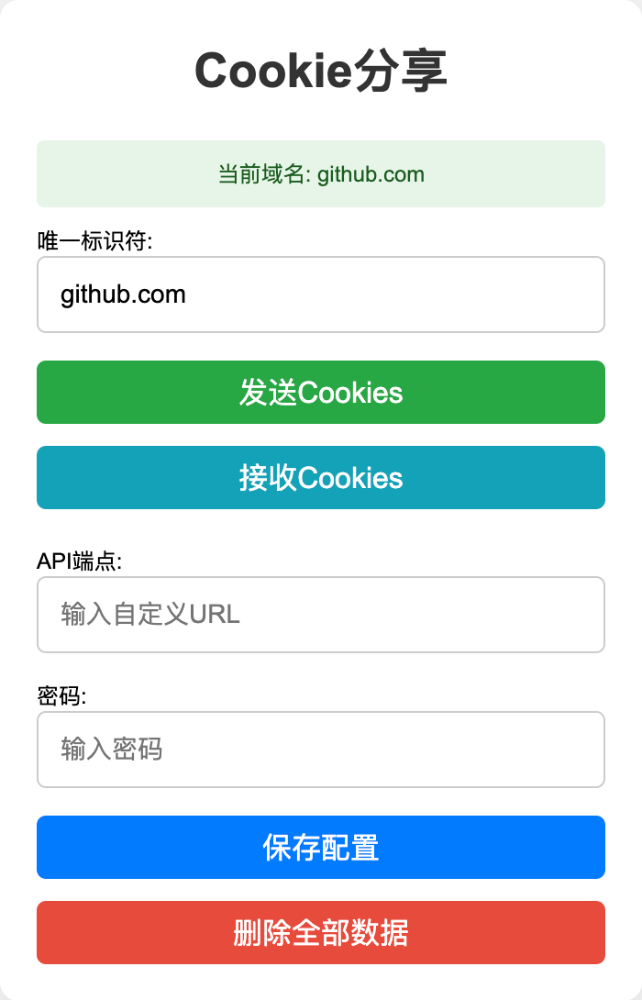

# Cookie分享 Chrome/Edge 扩展

> 注：仅供学习交流，严禁用于商业用途，请于24小时内删除，禁止在社交平台传播。如果本项目对你有用麻烦点个 star 这对我很有帮助，谢谢！

## 概述

Cookie分享 是一个 Chrome 扩展，允许用户在不同设备或浏览器之间发送和接收 cookies。它使用 Cloudflare Worker 作为后端来存储和检索 cookie 数据。

### 效果与应用场景
- 多账号切换不便？
- 视频会员分享麻烦？
- 合租共享某星球的账号？
- 懒得输入密码换设备登录？

### 使用步骤
1. 进入已登录网站的主页。
2. 点击插件图标，发送 Cookie。
3. 在未登录设备访问登录页，接收cookie。

已测试的网站:
- 某星球
- 某艺
- 某L站

## 安装

1. 克隆此仓库或下载源代码。
2. 打开 Chrome 并导航至 `chrome://extensions/`。
3. 启用"开发者模式"。
4. 点击"加载已解压的扩展程序"并选择扩展文件目录。

## 使用方法

1. 开启 Chrome/Edge 浏览器的开发者模式。
2. 将修改好的压缩包 `cookie-share.zip` 拖动到浏览器中。
3. 点击工具栏中的 Cookie分享 图标。
4. 在已登录的页面发送 Cookie。
5. 在未登录的页面接受 Cookie。
6. 注意地址后面不要加 `/`，示例: `https://your-worker.workers.dev`

### 后端部署教程

1. [注册](https://dash.cloudflare.com/sign-up) Cloudflare 账户并创建一个 Worker。

2. 复制 `worker.js` 文件的内容到新创建的 Worker 中。

3. 在 Cloudflare Worker 的设置中，添加以下环境变量：
   - `ADMIN_PASSWORD`: 设置一个强密码

4. 在 Worker 的设置中，绑定 KV 命名空间：
   - 变量名称：`COOKIE_STORE`
   - KV 命名空间：选择你创建的 KV 命名空间

5. 保存并部署 Worker。

## 安全注意事项

- 设置强密码 `ADMIN_PASSWORD`，定期更改。
- 不要在代码中硬编码密码，使用环境变量。

## 贡献

欢迎贡献！请随时提交 Pull Request。

## Star History

## 许可证

MIT